# AI Melodije :notes:

Online platforma za pretraživanje, slušanje i objavljivanje AI generiranih melodija (AI glazbenih albuma).

# Pozadinski dio aplikacije (Web REST API)

Za ispravan rad poslužiteljske strane potrebno je nabaviti [Spotify API ključ](https://developer.spotify.com/documentation/web-api) te zapisati *app:spotify:client-id* i *app:spotify:client-secret* u src/main/resources/application.yml konfiguraciju.

### Produkcija

##### 1. Pozicioniranje u direktorij izvornog koda
```bash
cd Software/api/
```

##### 2. Kreiranje Docker slike (*engl.* image) Spring Boot aplikacije (API)
```bash
./gradlew bootBuildImage
```

##### 3. Pokretanje Docker kontejnera (*engl.* containers) pomoću Docker-compose
```bash
docker-compose up [--detach]
```

### Razvojno okruženje

##### 1. Pozicioniranje u direktorij izvornog koda
```bash
cd Software/api/
```

##### 2. Pokretanje PostgreSQL i Redis Docker kontejnera
```bash
docker-compose up postgres redis [--detach]
```

##### 3. Pokretanje Spring aplikacije
```bash
./gradlew bootRun
```

### Postman API

Popis Web API resursa (*engl.* endpoints), zajedno s parametrima, dostupan je putem [Postman API kolekcije](./Documentation/AI-Melodies-API.postman_collection.json).

### ERA Model

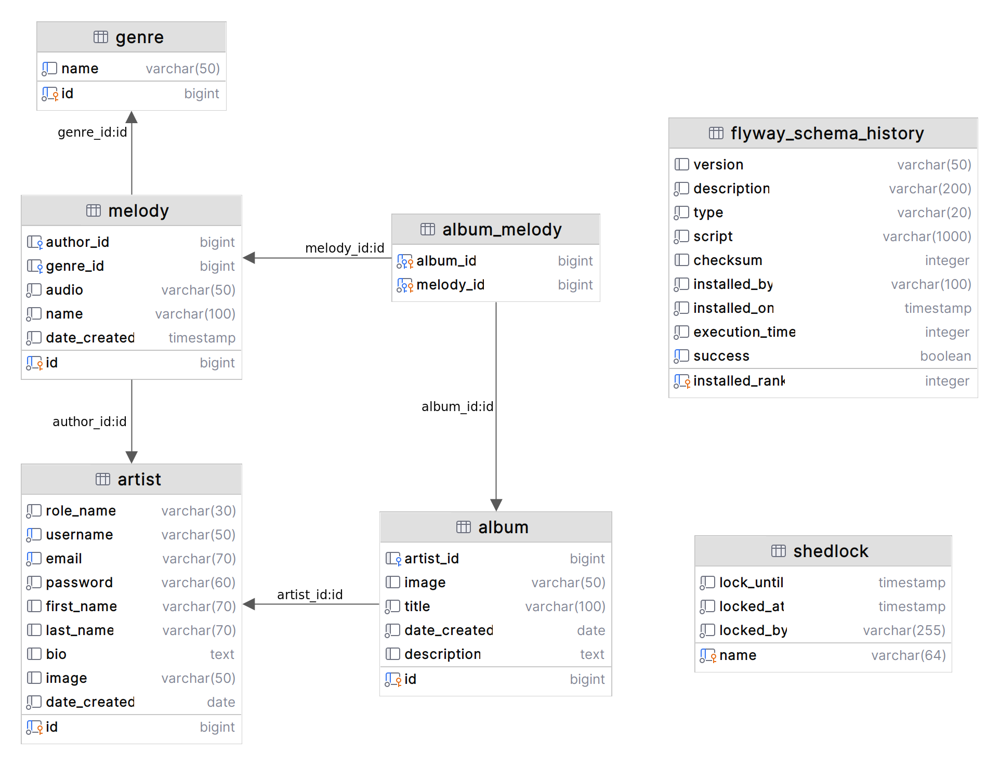

### Korišteni alati, okviri i moduli

#### [Spring okvir](https://spring.io/) (Spring Boot `3.0.2`)
- Spring Boot Web
- Spring Boot WebFlux
- Spring Boot HATEOAS
- Spring Boot Validation
- Spring Boot Data JPA
- Spring Boot Data Redis
- Spring Boot JOOQ
- Spring Boot Session Core
- Spring Boot Session Data Redis
- Spring Boot Security
- Spring Boot Test
- Spring Boot Security Test

#### Eksterni moduli
- [Flyway](https://flywaydb.org/) - migracija baze
- [Ktlint](https://github.com/pinterest/ktlint) - stil i format koda
- [Kover](https://github.com/Kotlin/kotlinx-kover) - pokrivenost Kotlin testova
- [JOOQ](https://www.jooq.org/) - objektno-orijenitrani SQL upiti
- [Auth0 Java JWT](https://github.com/auth0/java-jwt) - sigurnost
- [Shedlock](https://github.com/lukas-krecan/ShedLock) - distribuirano zaključavanje zadataka
- [kotlin-logging](https://github.com/oshai/kotlin-logging) - Kotlin logiranje
- [PostgreSQL](https://hub.docker.com/_/postgres) - SQL baza podatka
- [Redis](https://hub.docker.com/_/redis) - brza NoSQL (ključ/vrijednost) baza podataka
- [MockK](https://mockk.io/) - kreiranje lažnih (*engl.* mock) objekata u Kotlinu

#### Alati
- [IntelliJ IDEA](https://www.jetbrains.com/idea/) `2022.3.2` (Ultimate Edition)
- [DataGrip](https://www.jetbrains.com/datagrip/) `2022.3.2`
- [Kotlin](https://kotlinlang.org/) `1.7.22`
- [OpenJDK](https://openjdk.org/projects/jdk/17/) `17`
- [Docker](https://www.docker.com/) `23.0.1`
- [Docker Compose](https://docs.docker.com/compose/) `2.15.1`
- [Postman](https://www.postman.com/) `10.10.8`
- [Git](https://git-scm.com/) `2.34.1` i [GitHub](https://github.com/)

Aplikacija razvijena i testirana na Linux Mint 21.1 (5.15.0-60-generic).

# Klijentski dio aplikacije

Prototip aplikacije dostupan je putem sljedećeg [linka](https://www.figma.com/file/YR1ROBbX0QlgVe0RadPViT/AI-Melodije?node-id=0%3A1&t=Yt3Mkb70sWJwkv66-1).

### Produkcija

##### 1. Pozicioniranje u direktorij izvornog koda
```bash
cd Software/app/
```

##### 2. Kreiranje Docker slike (*engl.* image) Angular aplikacije (APP) pomoću `pack CLI (nginx)`
```bash
./nginx
```

##### 3. Pokretanje Docker kontejnera (*engl.* containers) pomoću Docker-compose
```bash
docker-compose up [--detach]
```

### Razvojno okruženje

##### 1. Pozicioniranje u direktorij izvornog koda
```bash
cd Software/app/
```

##### 2. Instalacija potrebnih npm modula
```bash
npm i
```

##### 3. Pokretanje Angular aplikacije
```bash
npm start
```

### Korišteni alati, okviri i moduli

- [Figma](https://www.figma.com/)
- [Webstorm](https://www.jetbrains.com/webstorm/) `2022.3.3`
- [npm](https://www.npmjs.com/) `9.2.0`
- [Typescript](https://www.typescriptlang.org/) `4.8.2`
- [Angular](https://angular.io/) `15.2`
- [Pico.css](https://picocss.com/) `1.5.7`
- [SASS](https://sass-lang.com/)
- [pack CLI](https://buildpacks.io/docs/tools/pack/) `0.28.0`
- [Docker](https://www.docker.com/) `23.0.1`
- [Docker Compose](https://docs.docker.com/compose/) `2.15.1`
- [Git](https://git-scm.com/) `2.34.1` i [GitHub](https://github.com/)

### Prikaz Web sučelja

#### Početna stranica


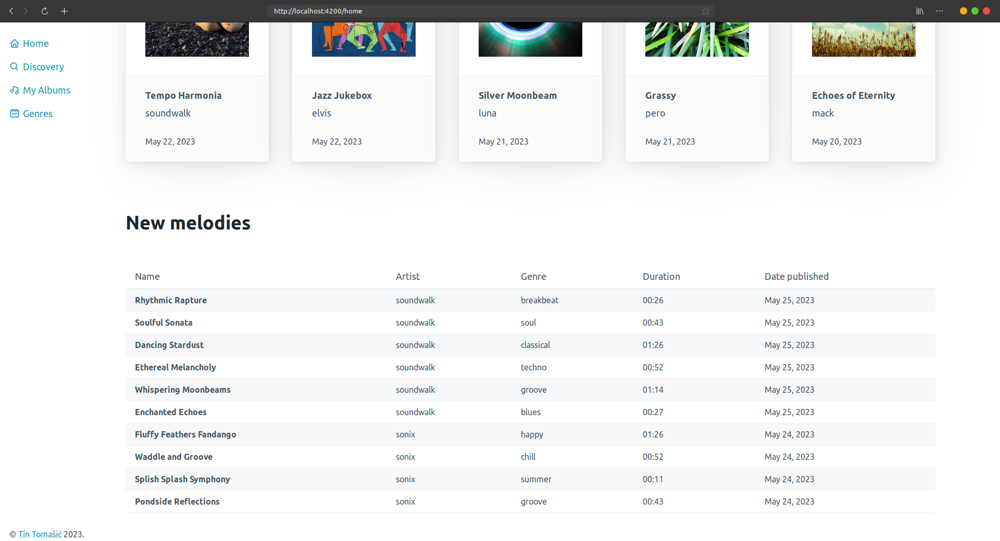

#### Tamni način rada

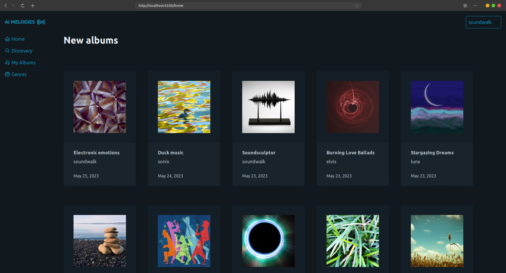

#### Album

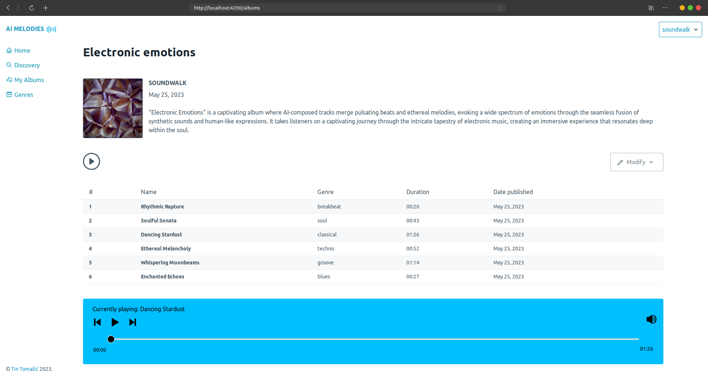
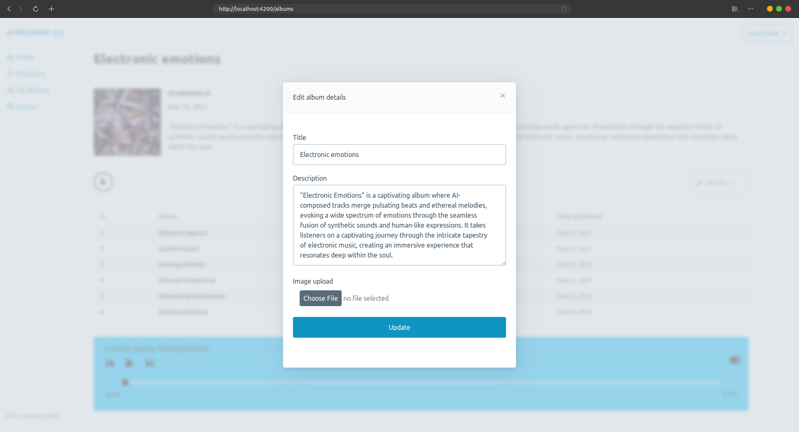

#### Melodija

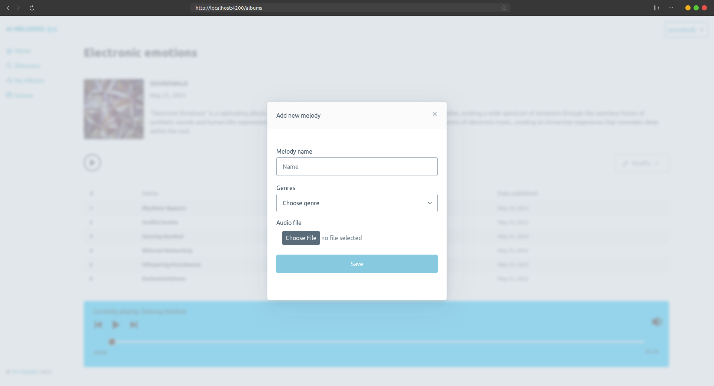

#### Moji albumi

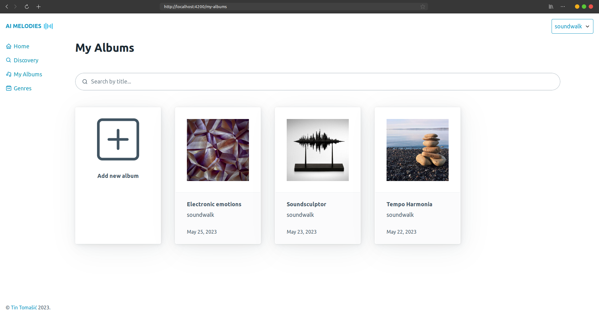

#### Globalno pretraživanje

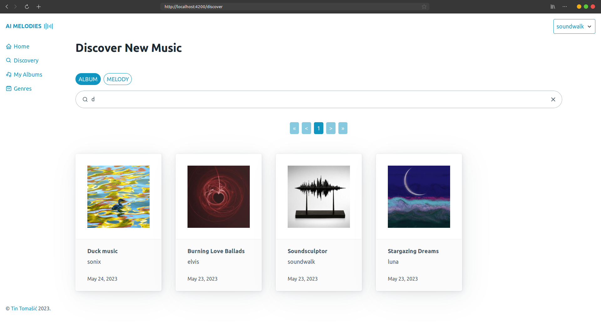
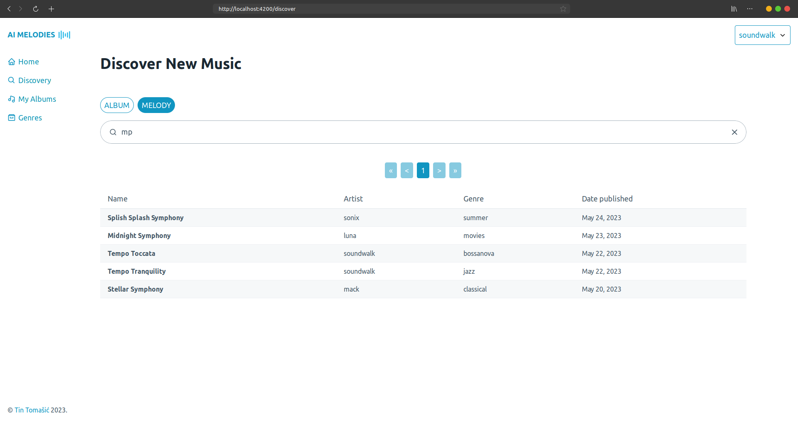

#### Profil

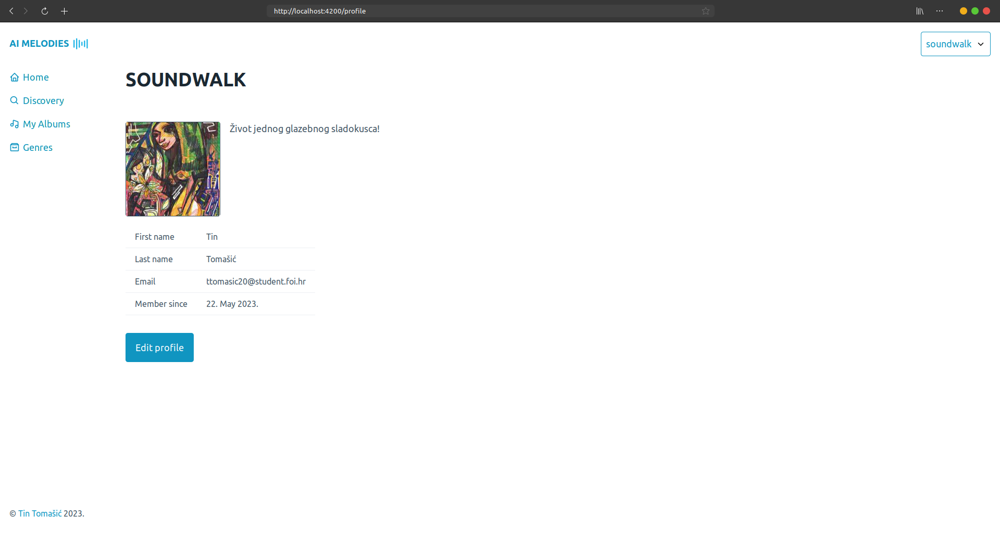
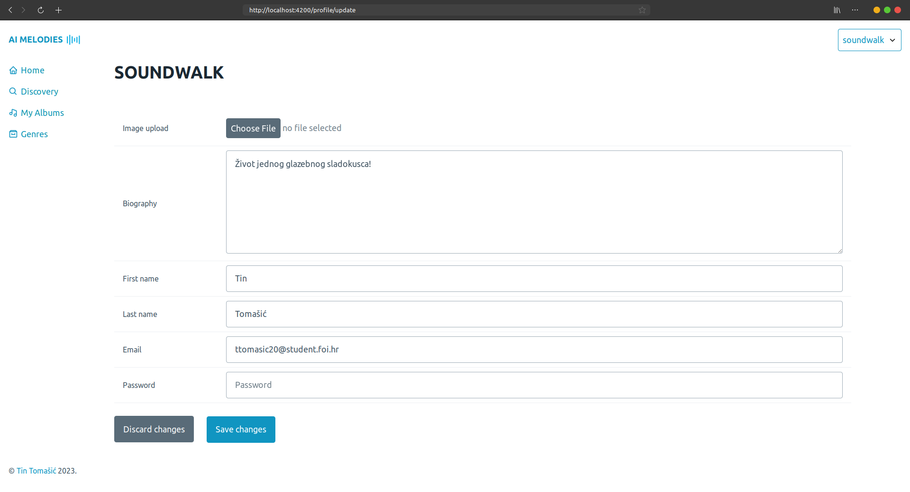

#### Upravljanje žanrovima

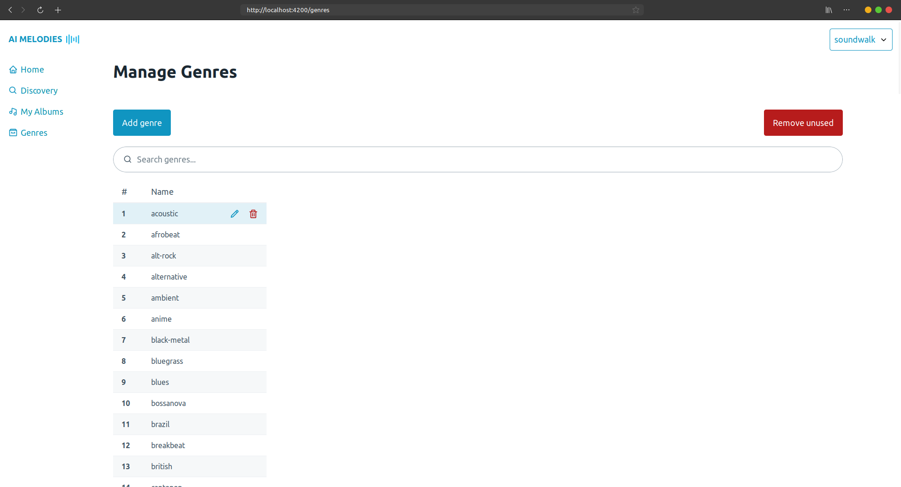
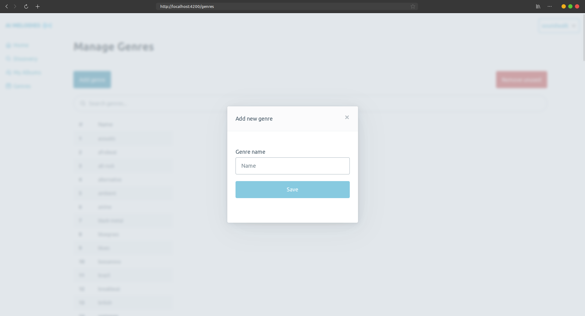

